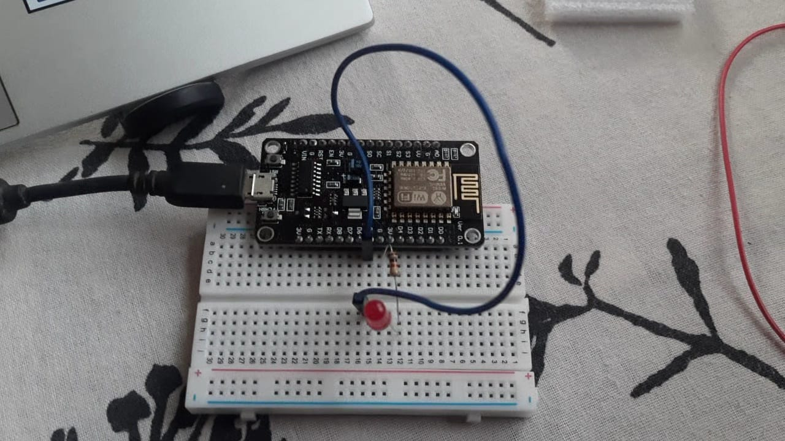
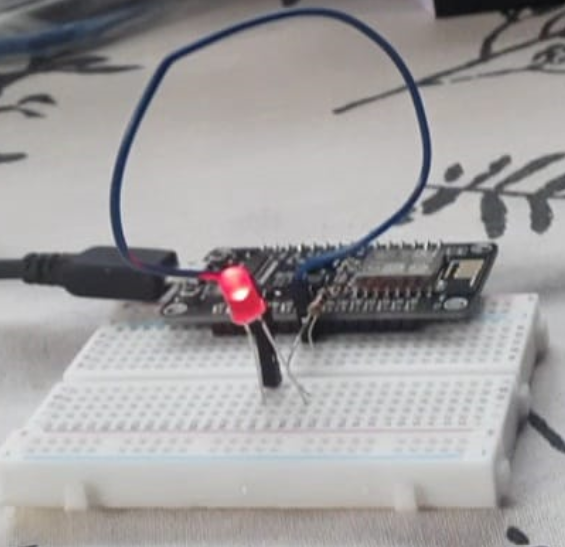

# NodeMcu-Project

 

# Parts Required For Building The Circuit:-
 
 
 
<ul>
  <li>Jumper Wires</li>
  <li>Breadboard</li>
 <li>Resistor(1ohm)</li>
  <li> led </li>
  <li>Nodemcu ESP 8266(Main Computing Part of the Circuit)</li>
 
  
  
</ul>

# Working Principle

Here we create an Website & programme the Nodemcu in such a way that we control an led with that website without requiring any other devices we can switch on & off the Led 

# Code 

 Pin.no must be followed properly while constructing the circuit 
[Code](https://github.com/Shinjan-saha/IOT-Nodemcu/blob/main/code.ino)
 

# Working Website:-

 The Working Website Open on the Local Network type"esp8266.local" in any browser in my case I used edge

 

# Working Circuit:-

 
